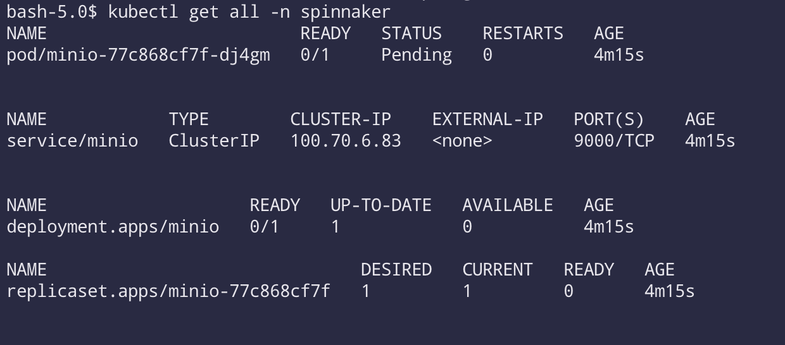
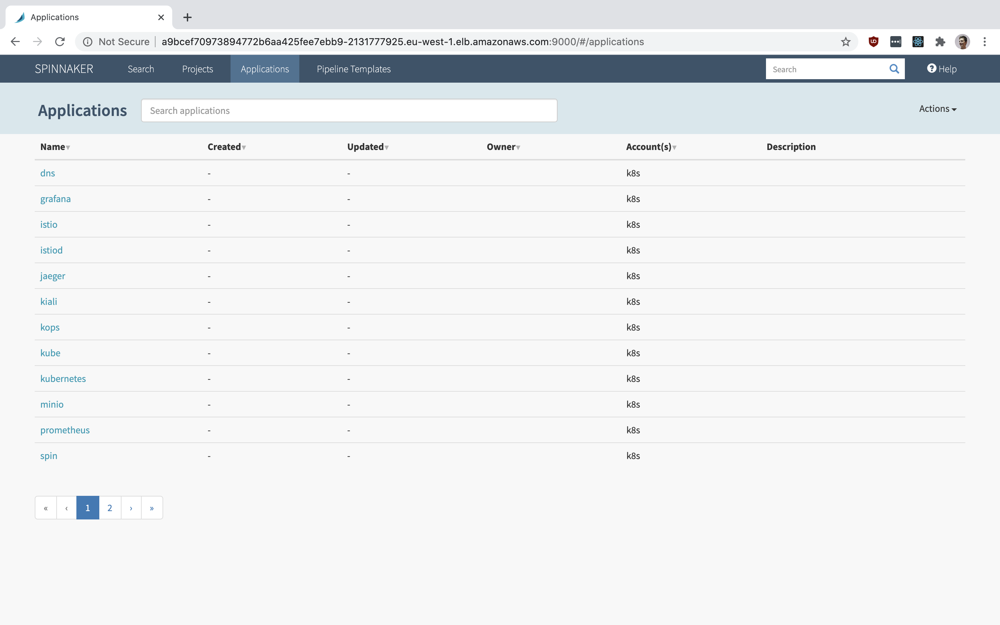

# Install Spinnaker

Spinnaker is a Continuous Delivery (CD) tool that was spun out of Netflix that integrates natively with Kubernetes and offers a large range of integration and feature support. It has a wide range on configuration options, widely adopted, and quickly becoming the preferred CD tool for operation teams to deploy artifacts when new version are published to an artifact repository, into Kubernetes.

The command can be either run from your local machine, or the bastion k8s node. In production or enterprise environments it will be the bastion. This tutorial assumes you use this approach and the commands are specific for that, but are easy to adapt if you wish to use your local machine.

Please note as well, Hal is being depreciated and being replaced by [Kleat](https://github.com/spinnaker/kleat). This aims to simplify the deployment and management process and improve upon how spinnaker is managed.


#### Ensure `.kube` directory exists
Before you begin, ensure the config directory for `kubectl` exists along with the file `~/.kube/config`
```bash
mkdir ~/.kube
```

#### Ensure `.hal` directory exists
Ensure the ~/.hal directory exists so the container can store and persist the Hal config.

```bash
mkdir /root/.hal
```

#### Start Halyard Container
This command starts and mounts the `.hal` and `.kube` directories to persist configs between restarts.
```bash
docker run --name halyard -v ~/.hal:/home/spinnaker/.hal -v ~/.kube/config:/home/spinnaker/.kube/config -d gcr.io/spinnaker-marketplace/halyard:stable
```

#### SSH into Hal Container
```bash
docker exec -it halyard bash
```

#### Enable Kubernetes and create Hal account for k8s and your cluster
```bash
hal config provider kubernetes enable && \
CONTEXT=$(kubectl config current-context) && \
hal config provider kubernetes account add k8s --context $CONTEXT
```
##### Note
If you recieve an error like this, this means the the file permissions on the host OS where docker is running don't allow the container to write to it. Change the permissions on the .hal directory to something more open like `0766`.
```bash
! ERROR Failure writing your halconfig to path
  "/home/spinnaker/.hal/config": /home/spinnaker/.hal/config

- I know everything hasn't been quite right with me, but I can
  assure you now, very confidently, that it's going to be alright again.
- Failed to enable kubernetes
```

Command example:
```bash
chmod 0766 ~/.hal
```


#### Sets where to install Spinnaker to your k8s cluster
```
hal config deploy edit --type distributed --account-name k8s
```

#### List available versions of Spinnaker
```bash
hal version list
```

#### Select your Spinnaker version
Ensure you use a version >= 1.20.0 otherwise additional configuration will be needed.
```bash
hal config version edit --version 1.21.0
```

## Install MinIO Persistent Storage
MinIO is the recommended persistent storage backend to use as it is cross-cloud and reduces the external dependencies of your cluster via vendor lock-in. It is still valid however to use your clouds storage provider such as S3, but the choice is up to you. I only cover the MinIO storage option.

#### Install Helm on local machine/bastion
```bash
curl https://raw.githubusercontent.com/helm/helm/master/scripts/get-helm-3 | bash
```
#### Add Helm stable repo
```bash
helm repo add stable https://kubernetes-charts.storage.googleapis.com
```
#### Install minio in kubernetes cluster
```bash
kubectl create ns spinnaker && \
helm install minio --namespace spinnaker --set accessKey="minioadmin" --set secretKey="minioadmin" --set persistence.enabled=false stable/minio
```

### Back inside the halyard container
#### For minio, disable s3 versioning
```bash
mkdir ~/.hal/default/profiles
echo "spinnaker.s3.versioning: false" > ~/.hal/default/profiles/front50-local.yml
```
#### Set the storage type to minio/s3
```bash
hal config storage s3 edit --endpoint http://minio:9000 --access-key-id "minioadmin" --secret-access-key "minioadmin"
hal config storage s3 edit --path-style-access true
hal config storage edit --type s3
```

#### Finally, Deploy
This will take the config stored in the `~/.hal` directory and apply it to the kubernetes cluster.
```bash
hal deploy apply
```

Note, do not worry about this message, we will add the URLs in the next steps and make the needed changes.

```bash
Validation in default.security:
- WARNING Your UI or API domain does not have override base URLs
  set even though your Spinnaker deployment is a Distributed deployment on a
  remote cloud provider. As a result, you will need to open SSH tunnels against
  that deployment to access Spinnaker.
? We recommend that you instead configure an authentication
  mechanism (OAuth2, SAML2, or x509) to make it easier to access Spinnaker
  securely, and then register the intended Domain and IP addresses that your
  publicly facing services will be using.
```

#### Verify



#### Change the service type to either Load Balancer or NodePort
```bash
kubectl -n spinnaker edit svc spin-deck
kubectl -n spinnaker edit svc spin-gate
```

In each window that opens up to edit the service add the following two lines.

In Metadata, add:
```yaml
annotations:
  cloud.google.com/load-balancer-type: Internal
```

In Spec, change the type:
```yaml
type: LoadBalancer
```


#### Update config and redeploy
```bash
hal config security ui edit --override-base-url "http://<LoadBalancerIP/DNS>:9000"
hal config security api edit --override-base-url "http://<LoadBalancerIP/DNS>:8084"
hal deploy apply
```

You can now access the UI! If you see a screen similar to this you are done.

